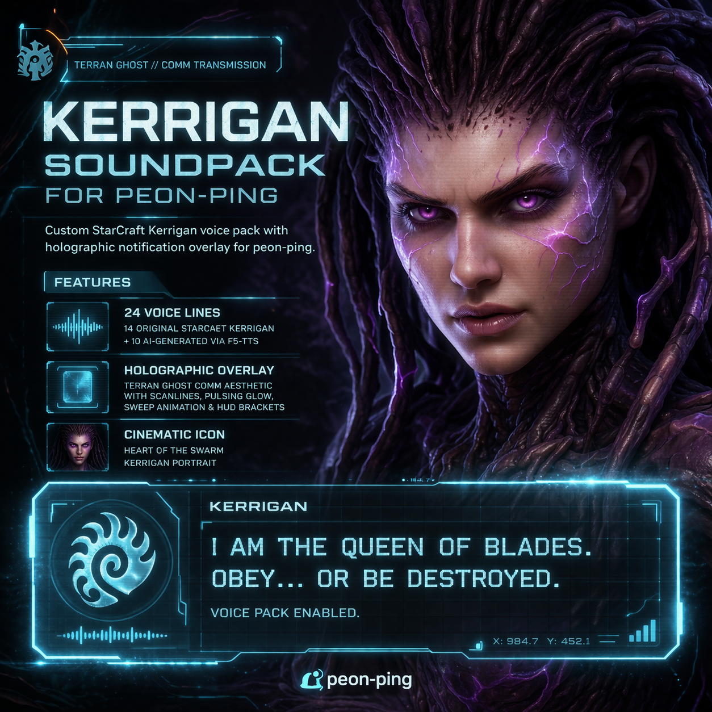
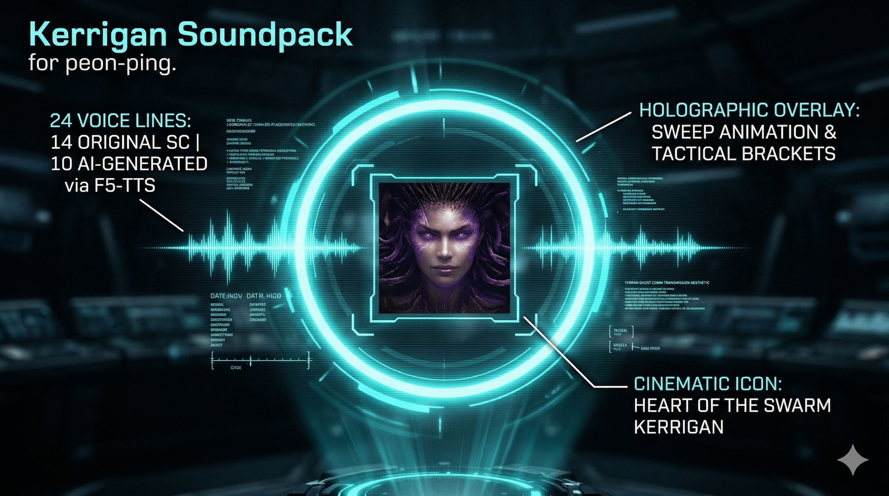

# Kerrigan Soundpack for peon-ping



Custom StarCraft Kerrigan voice pack with holographic notification overlay for [peon-ping](https://github.com/PeonPing/peon-ping).

## Features



- **42 voice lines** — 14 original StarCraft Kerrigan + 28 AI-generated via F5-TTS
- **Holographic overlay** — Terran Ghost comm transmission aesthetic with scanlines, pulsing cyan glow, sweep animation, and tactical HUD brackets
- **Cinematic icon** — Heart of the Swarm Kerrigan portrait

---

## Install (step by step)

### Step 1: Install peon-ping

If you don't have [peon-ping](https://github.com/PeonPing/peon-ping) installed yet:

```bash
curl -fsSL https://raw.githubusercontent.com/PeonPing/peon-ping/main/install.sh | bash
```

### Step 2: Clone this repo

```bash
git clone https://github.com/torresaionna/kerrigan-soundpack.git
cd kerrigan-soundpack
```

### Step 3: Run the installer

```bash
bash install.sh
```

This copies the Kerrigan voice pack, holographic overlay, and icon into peon-ping.

### Step 4: Verify

```bash
peon preview session.start       # hear Kerrigan's voice
peon notifications test           # see the holographic overlay
peon status                       # confirm sc_kerrigan is active
```

---

## Install via Claude Code (one prompt)

Open Claude Code and paste this prompt:

```
Please install the Kerrigan soundpack for peon-ping:

1. First install peon-ping if not already installed:
   curl -fsSL https://raw.githubusercontent.com/PeonPing/peon-ping/main/install.sh | bash

2. Then clone and install the Kerrigan pack:
   git clone https://github.com/torresaionna/kerrigan-soundpack.git ~/kerrigan-soundpack
   cd ~/kerrigan-soundpack && bash install.sh

3. Set the sounds to play on the default audio device (not Sound Effects device):
   Update use_sound_effects_device to false in ~/.claude/hooks/peon-ping/config.json

4. Test it:
   peon preview session.start
   peon notifications test
```

---

## Generate new voice lines

Uses [F5-TTS](https://github.com/SWivid/F5-TTS) to clone Kerrigan's voice from the included reference audio.

```bash
cd ~/kerrigan-soundpack/tts
bash generate.sh "Your custom line here" OutputFileName
```

A Python venv is created automatically on first run. After generating, add the new sound entry to `pack/openpeon.json` in the appropriate category, then run `bash install.sh` again to update peon-ping.

---

## Sound Preview

Preview all 42 voice lines with `peon preview --list` after installing, or browse them below:

<details>
<summary><b>session.start</b> — 5 sounds</summary>

| Sound | Line |
|-------|------|
| KerriganReporting | "Lieutenant Kerrigan reporting" |
| ImReady | "I'm ready" |
| SystemsReady | "All systems ready. Awaiting your orders." |
| GhostOnline | "Ghost online. Ready for action." |
| ChannelOpen | "Channel open. What are your orders?" |

</details>

<details>
<summary><b>task.acknowledge</b> — 11 sounds</summary>

| Sound | Line |
|-------|------|
| IGotcha | "I gotcha" |
| ThinkingSameThing | "Thinking the same thing" |
| BeAPleasure | "It'd be a pleasure" |
| IReadYou | "I read you" |
| OnIt | "On it. Consider it done." |
| TargetAcquired | "Target acquired. Moving in." |
| Analyzing | "Analyzing the situation. Stand by." |
| Understood | "Understood. Moving to intercept." |
| CopyThat | "Copy that. Engaging now." |
| WayAheadOfYou | "Way ahead of you." |
| ConsiderItHandled | "Consider it handled." |

</details>

<details>
<summary><b>task.complete</b> — 7 sounds</summary>

| Sound | Line |
|-------|------|
| ImReady | "I'm ready" |
| WaitingOnYou | "I'm waiting on you" |
| TaskDone | "Task complete. What's next?" |
| MissionComplete | "Mission complete. Ready for debriefing." |
| AreaSecure | "Area secure. Awaiting new directives." |
| ObjectiveComplete | "Objective complete. What else you got?" |
| CleanKill | "Clean kill. No complications." |

</details>

<details>
<summary><b>task.error</b> — 7 sounds</summary>

| Sound | Line |
|-------|------|
| Death1 | "Ah!" |
| Death2 | "Ah!" |
| SomethingWrong | "Something went wrong. We have a problem." |
| ErrorDetected | "Error detected. Recalibrating." |
| WeHaveAProblem | "We have a problem here." |
| DamnIt | "Damn it. That was not supposed to happen." |
| SystemFailure | "System failure. Rerouting." |

</details>

<details>
<summary><b>input.required</b> — 7 sounds</summary>

| Sound | Line |
|-------|------|
| WhatNow | "What now?" |
| WaitingOnYou | "I'm waiting on you" |
| NeedInput | "I need your input, commander." |
| StandingBy | "Standing by for further instructions." |
| TalkToMe | "Talk to me. What do you need?" |
| OrdersCommander | "Orders, commander?" |
| WaitingForSignal | "Waiting for your signal." |

</details>

<details>
<summary><b>user.spam</b> — 7 sounds</summary>

| Sound | Line |
|-------|------|
| EasilyAmused | "Easily amused, huh?" |
| Telepath | "Doesn't take a telepath to know what you're thinking" |
| AnnoyingPeople | "You get off on annoying people, don't you?" |
| GotAJobToDo | "I've got a job to do" |
| DontPushIt | "Don't push it." |
| PatienceWearing | "My patience is wearing thin." |
| LastWarning | "This is your last warning." |

</details>

## Uninstall

```bash
peon packs remove sc_kerrigan
```

To also remove the holographic overlay, reinstall peon-ping:

```bash
peon update
```
